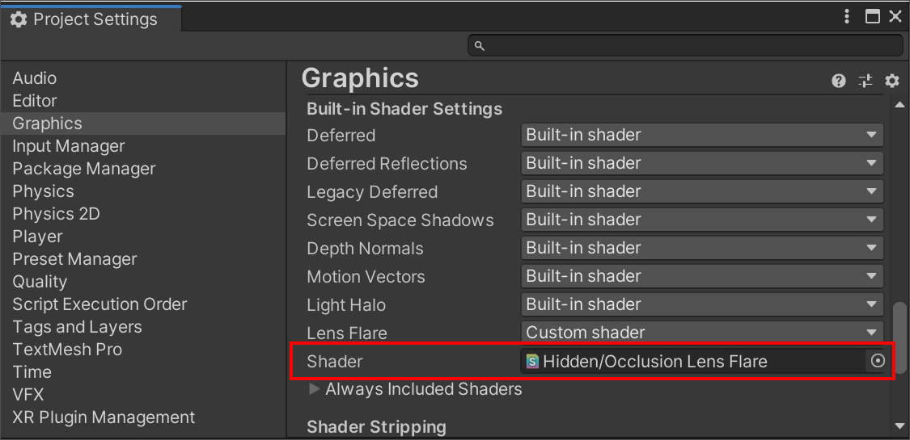
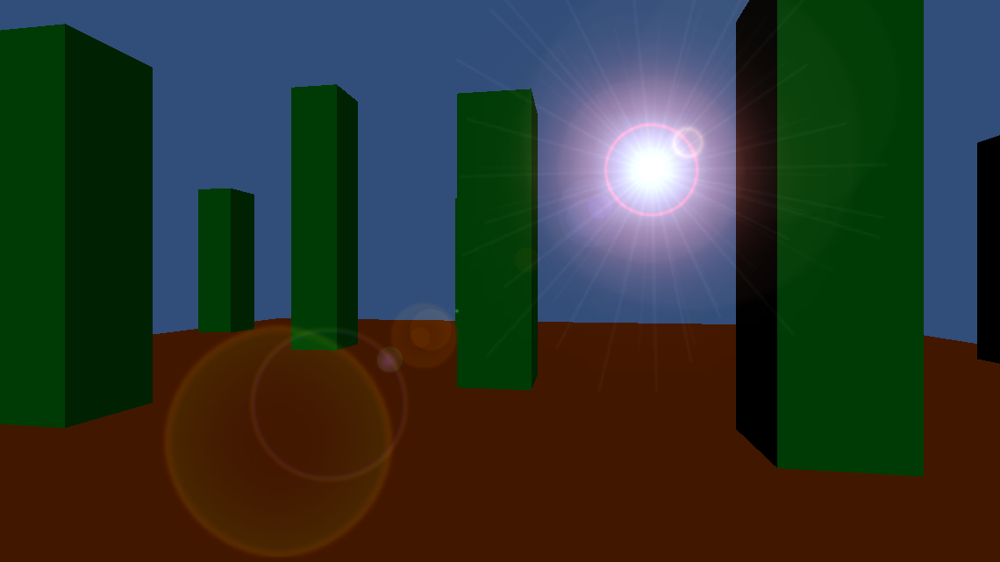

# Occlusion Lens Flare for Unity

The Occlusion Lens Flare package provides the ability to use Unity's built-in [Lens Flare](https://docs.unity3d.com/Manual/class-LensFlare.html) Component without Physics raycasts.

Please see the following video for a quick introduction,
[](http://www.youtube.com/watch?v=zaN5TLIMcFs "")

Unity's built-in Lens Flare requires the Physics engine by default, 
because it uses a Physics raycast to determine whether the sun is blocked by another object. 
Here is the relevant quote from the [documentation](https://docs.unity3d.com/Manual/class-LensFlare.html):
> Lens Flares are blocked by Colliders. A Collider in-between the Flare GameObject and the Camera will hide the Flare, even if the Collider does not have a Mesh Renderer.

There can be reasons why you might not want to use Unity's Physics engine and in this case, the built-in Lens Flare stops working.

This Occlusion Lens Flare package does not require Physics, it renders an occlusion texture instead. The occlusion texture contains the sun and any object in-between the sun and camera. The occlusion texture is then used to determine how many pixels are occluded from the sun, to control the Lens Flare opacity.

This approach comes with its own benefits and drawbacks:
* Benefit: The Occlusion Lens Flare knows more than on/off, it actually knows how much it's occluded and can adjust its opacity accordingly. Unity's Lens Flare only knows if a "single pixel" is occluded or not and tries to compensate the on/off flicker by introducing a fade setting.
* Benefit: It uses Unity's built-in Lens Flare Component to render the Flare, thus you can use all the existing Lens Flare assets that have been created for Unity already and of course create your own assets too.
* Drawback: The Occlusion Lens Flare requires to render an occlusion texture, which increases the number of draw-calls. However, the occlusion view frustum is small and it only renders objects that are inside the frustum. The occlusion texture itself is small as well, 64x64 pixels is sufficient already. Unity's Lens Flare does not add further draw-calls on the other hand.
* Drawback: The Occlusion Lens Flare supports a single Lens Flare only.
* Drawback: The editor Scene View integration does not work.
* Benefit&Drawback: The Occlusion Lens Flare is targeted to lower-end hardware. I created it in particular for mobile, thus it's not an actual simulation of a camera lens flare effect that you'd expect from high fidelity visuals. It's the same level of fidelity as Unity's built-in Lens Flare though.
 
# Installation

As of Unity 2019.3, Unity supports to add packages from git through the Package Manager window. 
In Unity's Package Manager, choose "Add package from git URL" and insert one of the Package URL's you can find below.

## Package URL's

| Version  |     Link      |
|----------|---------------|
| 1.1.0 | https://github.com/pschraut/UnityOcclusionLensFlare.git#1.1.0 |
| 1.0.0 | https://github.com/pschraut/UnityOcclusionLensFlare.git#1.0.0 |

# Credits

If this package is useful to you, please mention my name in your credits screen.
Something like "Occlusion Lens Flare by Peter Schraut" or "Thanks to Peter Schraut" would be very much appreciated.

# Honorable mentions

Thanks to bgolus and KokkuHub from the Unity forums for helping me getting this working.

You can read the discussion here: https://forum.unity.com/threads/how-to-create-a-lens-flare-effect-without-physics.1053590/

# Integration

## Override the built-in Lens Flare shader
Open ```Edit > Project Settings...``` and select the ```Graphics``` tab. 
Scroll down to the ```Built-in Shader Settings``` section and change the ```Lens Flare``` setting
from ```Built-in shader``` to ```Custom shader```.

Drag&drop the ```Shaders/OcclusionLensFlare.shader``` asset from the Occlusion Lens Flare package folder in Lens Flare shader setting.




# Example

Once you have overridden the built-in Lens Flare shader as mentioned in the ```Integration``` section, you can either just continue with Sample or follow all further integration steps below.

The Sample requires Unity's Cinemachine package, but the actual Occlusion Lens Flare does not.

* Open ```Window > Package Manager``` and install ```Cinemachine``` package from the ```Unity Registry```.
* Import the ```Occlusion Lens Flare Sample.unitypackage``` file found in the ```Occlusion Lens Flare/Samples~``` directory.
* Open ```Occlusion Lens Flare Scene``` and press ```Play```.

You should see this now:


Hold down the right mouse button and move the mouse to rotate the camera.
When the sun goes behind one of those green boxes, the Lens Flare should fade out.

# Integration step by step

In this section I describe how to replicate the Occlusion Lens Flare Sample.

TODO


# How it works

TODO

In this video I go into more detail how it actually works.
[](http://www.youtube.com/watch?v=d-0M50W1byk "")

